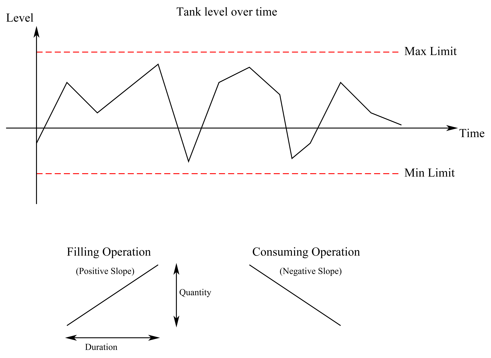
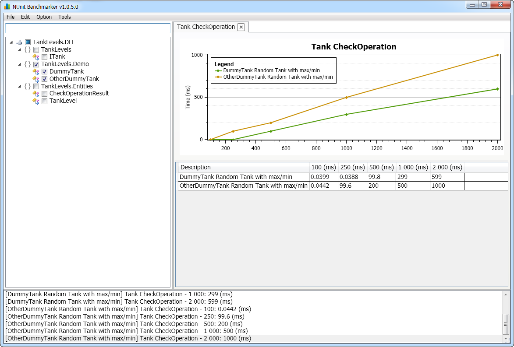

# Stockpile Mangement

We have a buffer tank that has liquid put into and taken away from it at different points in time. The buffer tank has a min and max limit.

The picture below shows how the levels in the tank change over time:


 


## Aim

We need a function which will tell us If and when we can add a new "filling" or "consuming" operation to the tank so that it does not go over (or under) the max (or min) limit.

The method signature is:

```csharp
Result CheckOperation(DateTime startTime, TimeSpan duration, double quantity, TankLevels tankLevels);
```

The "Result" should have two properties:
- IsSucess : bool
- StartTime : DateTime (NOTE: the Result.StartTime may be equal or greater to the startTime supplied to the CheckOperation() method. Part of the challenge of this problem is finding the earliest time we can start the operation without breaching the limits.)

## Parameters

- "StartTime": Is the time we would like to start adding the operation to the tank.
- "Duration": is the duration of the operation
- "Quantity": is how much liquid will be added to the tank during the whole duration of the operation. (If the value is negative then, liquid will be taken away from the tank.) 
- "TankLevels": is a collection of points which give you the level in the tank at different times.

## Assumptions

- If the last tank level at time t is x, then we assume the tank to remain at this level for all time greater than t. (i.e. the tank level does not drop to 0 after then last data point. Instead it remains at the same level.)
- The filling and consuming operations have a constant rate.

## Infrastructure

This repository is prepared to jump start your implementation instantly, with very little effort from you.
Unit tests and performance tests are provided out of the box. (So if you are still unclear about the problem please read the unit tests.)

The Visual Studio solution consist of three projects:

* TankLevels
* TankLevels.Tests
* TankLevels.PerformanceTests

**TankLevels project** 

The TankLevels project defines the

* ITank interface with the CheckOperation method.
* TankLevel entity 
* CheckOperationResult entity

It also defines two dummy implementations for demonstrating how a future implementation fits to the unit test and performance test infrastructure.
The two dummy implementations are:
* DummyTank
* OtherDummyTank

**TankLevels.Tests project** 

The TankLevels.Tests project contains the unit test infrastructure and the actual unit tests. Start with reading the detailed summary documentation of the TankLevel class.

The only dependency of the project is the NuGet NUnit package.

**TankLevels.PerformanceTests project** 

The TankLevels.Tests project contains the performance test infrastructure and the actual performance tests. 

The performance tests implemented using NunitBenchmarker (https://github.com/Orcomp/NUnitBenchmarker). Start with the TankPerformanceTests class and run the tests just as you would run an ordinary unit test.

To get an instant picture of how the performance test should look like please see the picture below:

 

**Getting the dependencies** 

All dependencies are managed by the NuGet package manager.
The simplest way to get all the dependencies is using the provided RestorePackages.bat in the repository root.

## Support

Please create an issue if you need support.

## Guidelines

- Clone this project but do not commit your implementation (otherwise others will be able to see your implementation.)
- Do send pull requests for new Unit Tests.

## License

This project is open source and released under the [MIT license.](License.txt)

